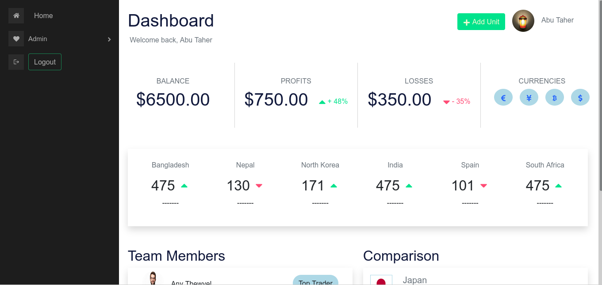

<h2>This is single page dashboard site using reactJs, Bootstrap and firebase.</h1>
[link](https://dashboard-app-fawn.vercel.app/)

```
I use 'firebase' for google authentication and registration using email and password.

I use 'react-pro-sidebar' for built-in sidebar. And also use 'react-toastify' for error massage showing.

And use 'react-icons' and 'react-router-dom' for routing.


If run this projects in your pc clone this and
'npm install' then 'npm start'


```


